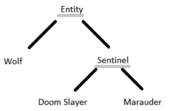

# Darea de seamă la Java: Lucrare de laborator nr. 2

Tema: Mostenire in java. Clase abstracte si Interfete

Varianta: Nr. 16

Efectuat: Țurcanu Cristian, studentul grupei IA1901

Verificat: Epifanova Irina, lector universitar, magistru în informatică

## Formularea problemei:

1. De descris o ierarhie de clase (minimum 4). Clasa de baza sa fie abstractă cu minimum o funcție abstractă. 
2. De descris clasa Main cu funcția main în afara ierarhiei.
3. De descris minimum 2 interfețe, fiecare sa fie implementata minimum de o clasa din ierarhie.
4. Fiecare clasa moștenita trebuie sa aiba metode și cimpuri unice.
5. De a apela constructorii claselor părinți cu parametri și fără.
6. De a apela metodele simple din clasele părinți.
7. De a redefini în fiecare clasa Randomize în constructorul fără parametri.
8. De a redefini în fiecare clasa funcția de introducere a datelor de la tastatura.
9. De a redefini în fiecare clasa funcția de a înscriere în fișier.
10. De a crea minimum cite o variabila, functie, clasa final.
11. De a crea minimum cite o variabila, functie static.
12. De a folosi instanceof și conversia tipurilor obiectelor
13. În main de a crea minimum 2 vectori de obiecte de tipul: clasei de baze &amp;&amp; interfeței. 
14. În funcția main, pentru obiectele create, de a chema funcțiile unice din clasele corespunzătoare, și de a afișa obiectele
create la ecran.
15. De descris in dare de seama conditiile variantei proprie asa, cum este aratat in Exemple de mai jos
16. de spus “URRRRRRAAAAAAA ! ! !” și de prezintat profesorului al doilea laborator. :)

## Schema claselor:



## Codul sursă

IMelee.java

```java
package laborator.pkg2;

public interface IMelee {
    public void MeleeAttack(Entity target);
}

```

IRanged.java

```java
package laborator.pkg2;

public interface IRanged {
    public void RangedAttack(Entity target);
}

```

Entity.java

```java
package laborator.pkg2;

public abstract class Entity {
    public int hitPoints;
    
    public Entity() {
        hitPoints = 20 + Helper.randomizer.nextInt(20);
    }
    
    public Entity(int hitPoints) {
        this.hitPoints = hitPoints;
    }
    
    public abstract void Attack(Entity target);
    
    public void Damage(int damage) {
        hitPoints -= damage;
    }
    
    public boolean InstaKill() {
        hitPoints = 0;
        return true;
    }
    
    public boolean IsAlive() {
        return hitPoints > 0 ? true : false;
    }
    
    public String Serialize() {
        return Helper.gson.toJson(this);
    }
    
    public void KbInput() {
        Helper.print("Hit points: ");
        hitPoints = Helper.InputIntLimit(0);
    }
    
    public void PrintStats() {
        Helper.print("Entity " + hitPoints + " hp ");
    }
}
```

Wolf.java

```java
package laborator.pkg2;

public class Wolf extends Entity implements IMelee {
    
    int nullHowlCount;
    
    public Wolf() {
        super();
        nullHowlCount = 1 + Helper.randomizer.nextInt(3);
    }
    
    public Wolf(int hitPoints, int nullHowlCount) {
        super(hitPoints);
        
        this.nullHowlCount = nullHowlCount;
    }
    
    public void Attack(Entity target) {
        MeleeAttack(target);
    }
    
    public void MeleeAttack(Entity target) {
        target.Damage(20);
    }
    
    public void Damage(int damage) {
        float distance = Helper.randomizer.nextFloat() * 20;

        if (distance < 5f) {
            hitPoints -= damage;
        } else {
            if (Helper.randomizer.nextBoolean()) {
                hitPoints -= damage;
            }
            
            //if enemy is too far then the wolf has a chance to dodge 
        }
    }
    
    public void ProtectMarauder(int damage) {
        if (nullHowlCount > 0) {
            nullHowlCount--;
        } else {
            Damage(damage);
        }
        
        //the wolf can nullify some attacks, then it sacrifices itself to protect
    }
    
    public void KbInput() {
        super.KbInput();
        
        Helper.print("Null howl count: ");
        nullHowlCount = Helper.InputIntLimit(0);
    }
    
    public void PrintStats() {
        super.PrintStats();
        Helper.print("Wolf " + nullHowlCount + " null howl(s) ");
    }
    
    
}

```

Sentinel.java

```java
package laborator.pkg2;

public abstract class Sentinel extends Entity implements IMelee, IRanged {

    public Sentinel() {
        super();
        
        hitPoints = 60 + Helper.randomizer.nextInt(20);
    }
    
    public Sentinel(int hitPoints) {
        super(hitPoints);
    }
    
    public void Attack(Entity target) {
        float distance = Helper.randomizer.nextFloat() * 20;

        if (distance < 5f) {
            MeleeAttack(target);
        } else {
            RangedAttack(target);
        }
    }

    public final boolean InstaKill() {
        //immune to instakill
        return false;
    }
    
    public void PrintStats() {
        super.PrintStats();
        
        Helper.print(" sentinel ");
    }
}
```

DoomSlayer.java

```java
package laborator.pkg2;

public final class DoomSlayer extends Sentinel {

    int ammo;
    
    public DoomSlayer() {
        super();
        
        ammo = 15 + Helper.randomizer.nextInt(10);
    }
    
    public DoomSlayer(int hitPoints, int ammo) {
        super(hitPoints);
        
        this.ammo = ammo;
    }

    public void MeleeAttack(Entity target) {
        
        if (hitPoints < 50) {
            BloodPunch(target);
        } else if (ammo < 10) {
            //saw
            Chainsaw(target);
        } else {
            //crucible
            target.InstaKill();
        }
    }

    public void RangedAttack(Entity target) {
        target.Damage(15);
        ammo--;
    }

    public void BloodPunch(Entity target) {
        target.Damage(20);
        this.hitPoints += 30;
    }

    public void Chainsaw(Entity target) {
        if (target.InstaKill()) {
            ammo += 10;
        }
    }
    
    public void KbInput() {
        super.KbInput();
        
        Helper.print("Ammo: ");
        ammo = Helper.InputIntLimit(0);
    }
    
    public void PrintStats() {
        super.PrintStats();
        
        Helper.print(" doom slayer " + ammo + " bullets");
    }

}

```

Marauder.java

```java
package laborator.pkg2;

public class Marauder extends Sentinel {

    public Wolf summonedWolf;

    public Marauder() {
        super();

        if (Helper.randomizer.nextBoolean()) {
            SummonWolf();
        }
    }
    
    public Marauder(int hitPoints, Wolf summonedWolf) {
        super(hitPoints);
        
        this.summonedWolf = summonedWolf;
    }

    public void MeleeAttack(Entity target) {
        //axe
        target.Damage(20);
    }

    public void RangedAttack(Entity target) {
        target.Damage(15);
    }

    public void Damage(int damage) {
        float distance = Helper.randomizer.nextFloat() * 20;

        if (distance < 5f) {
            if (summonedWolf.IsAlive()) {
                summonedWolf.ProtectMarauder(damage);
            } else {
                hitPoints -= damage;
            }
        }

        //if enemy is too far then shield is triggered
    }

    public void SummonWolf() {

        if (summonedWolf == null
                || !summonedWolf.IsAlive()) {
            summonedWolf = new Wolf();
        }
    }

    public void KbInput() {
        super.KbInput();

        Helper.print("Initialize wolf? true/false: ");
        boolean initWolf = Boolean.valueOf(Helper.InputString());

        if (initWolf) {
            summonedWolf = new Wolf();
            summonedWolf.KbInput();
        }
    }
    
    public void PrintStats() {
        super.PrintStats();
        
        Helper.print(" marauder ");
        
        if (summonedWolf != null) {
            summonedWolf.PrintStats();
        }
    }

}

```

Laborator2.java

```java
package laborator.pkg2;

public class Laborator2 {
    public static void main(String[] args) {
        Entity[] entities = new Entity[] {
            new DoomSlayer(),
            new Marauder(60, null),
            new Wolf(),
            new Marauder()
        };
        
        entities[0].KbInput();
        entities[3] = Helper.gson.fromJson(entities[0].Serialize(), DoomSlayer.class);
        
        for (int i = 0; i < entities.length; i++) {
            entities[i].PrintStats();
            Helper.println("");
        }
        
        for (int i = 0; i < entities.length; i++) {
            if (entities[i] instanceof Marauder && ((Marauder)entities[i]).summonedWolf == null) {
                ((Marauder)entities[i]).SummonWolf();
            }
        }
        
        Helper.println("");
        
        for (int i = 0; i < entities.length; i++) {
            entities[i].PrintStats();
            Helper.println("");
        }
        
        IRanged[] ranged = new IRanged[entities.length];
        Helper.println("");
        
        for (int i = 0; i < entities.length; i++) {
            if (entities[i] instanceof IRanged) {
                ranged[i] = ((IRanged)entities[i]);
            } else {
                ranged[i] = new Marauder();
            }
            
            if (ranged[i] instanceof DoomSlayer) {
                ((DoomSlayer)ranged[i]).BloodPunch((DoomSlayer)ranged[i]);
                ((DoomSlayer)ranged[i]).PrintStats();
                Helper.println("");
            } else if (ranged[i] instanceof Marauder) {
                ((Marauder)ranged[i]).SummonWolf();
                ((Marauder)ranged[i]).PrintStats();
                Helper.println("");
            }
        }
        
        for (int i = 0; i < entities.length; i++) {
            Helper.FileWrite(i + ".json", entities[i].Serialize());
        }
    }
    
}

```

Helper.java

```java
package laborator.pkg2;

import java.util.Random;
import com.google.gson.Gson;
import java.io.*;

public class Helper {

    public static Random randomizer = new Random();
    public static Gson gson = new Gson();

    public static String InputString() {
        BufferedReader box = new BufferedReader(new InputStreamReader(System.in));

        String str = "";
        try {
            str = box.readLine();
        } catch (Exception e) {
            System.out.println("Shit's fucked man");
            System.out.println(e);
        }

        return str;
    }

    public static int InputInt() {
        boolean success = false;
        int result = 0;

        do {
            try {
                result = (Integer.valueOf(InputString())).intValue();
                success = true;
            } catch (Exception e) {
                System.out.println(e);
                System.out.print("Dati valoarea inca o data: ");
                success = false;
            }
        } while (!success);

        return result;
    }

    public static float InputFloat() {
        boolean success = false;
        float result = 0;

        do {
            try {
                result = (Float.valueOf(InputString())).floatValue();
                success = true;
            } catch (Exception e) {
                System.out.println(e);
                System.out.print("Dati valoarea inca o data: ");
                success = false;
            }
        } while (!success);

        return result;
    }

    public static int InputIntLimit(int min, int max) {
        int result = 0;

        do {
            result = InputInt();
            if (result < min || result > max) {
                println("Outside of limits [" + min + ", " + max + "], try again");
            }
        } while (result < min || result > max);

        return result;
    }

    public static int InputIntLimit(int min) {
        return InputIntLimit(min, Integer.MAX_VALUE);
    }

    public static float InputFloatLimit(float min, float max) {
        float result = 0;

        do {
            result = InputFloat();
            if (result < min || result > max) {
                println("Outside of limits [" + min + ", " + max + "], try again");
            }
        } while (result >= min && result <= max);

        return result;
    }

    public static float InputFloatLimit(float min) {
        return InputFloatLimit(min, Float.MAX_VALUE);
    }

    public static void println(String text) {
        System.out.println(text);
    }

    public static void print(String text) {
        System.out.print(text);
    }

    public static String FileRead(String path) {
        String result = "";
        try {
            BufferedReader box = new BufferedReader(new FileReader(path));
            
            String line;
            while ((line = box.readLine()) != null) {
                result += line;
            }
        } catch (Exception e) {
            println("Shit's fucked man");
            println(e.toString());
        }
        
        return result;
    }
    
    public static void FileWrite(String path, String text) {
        try {
            File file = new File(path);
            FileOutputStream fileOutputStream = new FileOutputStream(file);

            if (!file.exists()) {
                file.createNewFile();
            }

            byte b[] = text.getBytes();

            fileOutputStream.write(b);
            fileOutputStream.flush();
            fileOutputStream.close();
        } catch (Exception e) {
            println("Shit's fucked man");
            println(e.toString());
        }
    }
}

```

## Rezultatele rulării programului

```
Hit points: 50 <de la tastatura>
Ammo: 15 <de la tastatura>
Entity 50 hp  sentinel  doom slayer 15 bullets
Entity 60 hp  sentinel  marauder 
Entity 31 hp Wolf 2 null howl(s) 
Entity 50 hp  sentinel  doom slayer 15 bullets

Entity 50 hp  sentinel  doom slayer 15 bullets
Entity 60 hp  sentinel  marauder Entity 33 hp Wolf 1 null howl(s) 
Entity 31 hp Wolf 2 null howl(s) 
Entity 50 hp  sentinel  doom slayer 15 bullets

Entity 60 hp  sentinel  doom slayer 15 bullets
Entity 60 hp  sentinel  marauder Entity 33 hp Wolf 1 null howl(s) 
Entity 78 hp  sentinel  marauder Entity 28 hp Wolf 1 null howl(s) 
Entity 60 hp  sentinel  doom slayer 15 bullets
```

Fisiere: 

0.json

```json
{"ammo":15,"hitPoints":60}
```

1.json

```json
{"summonedWolf":{"nullHowlCount":1,"hitPoints":33},"hitPoints":60}
```

2.json

```json
{"nullHowlCount":2,"hitPoints":31}
```

3.json

```json
{"ammo":15,"hitPoints":60}
```